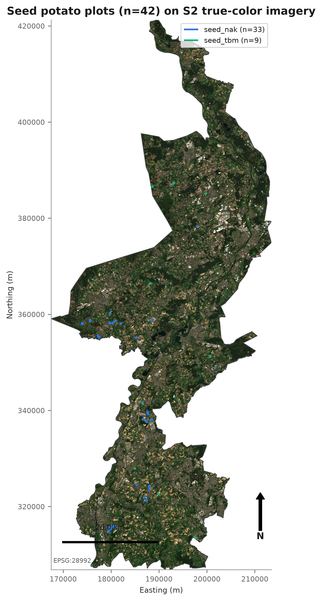
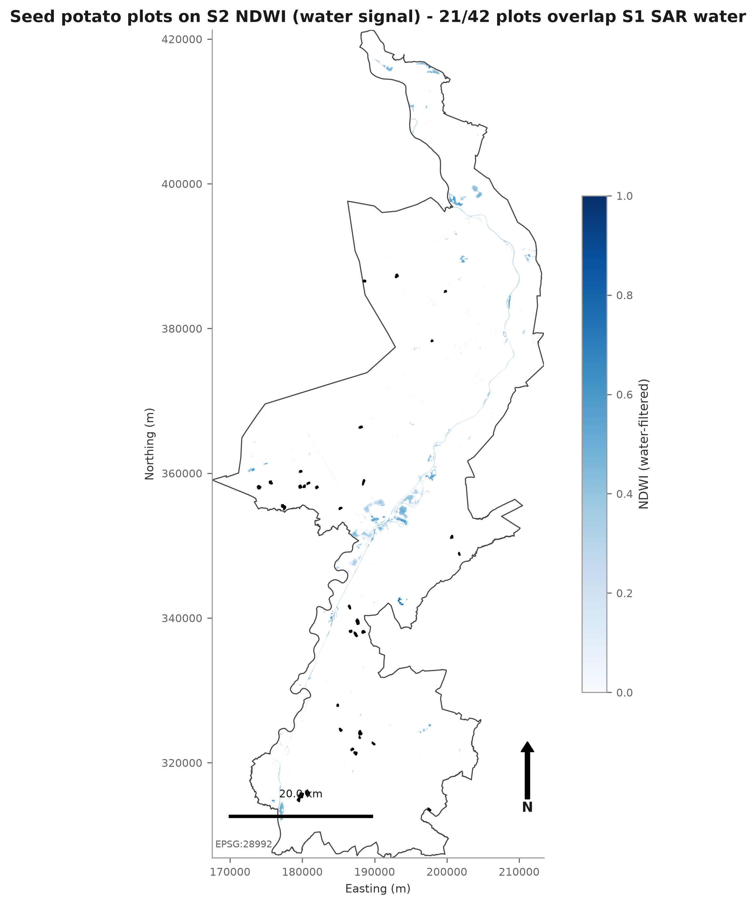
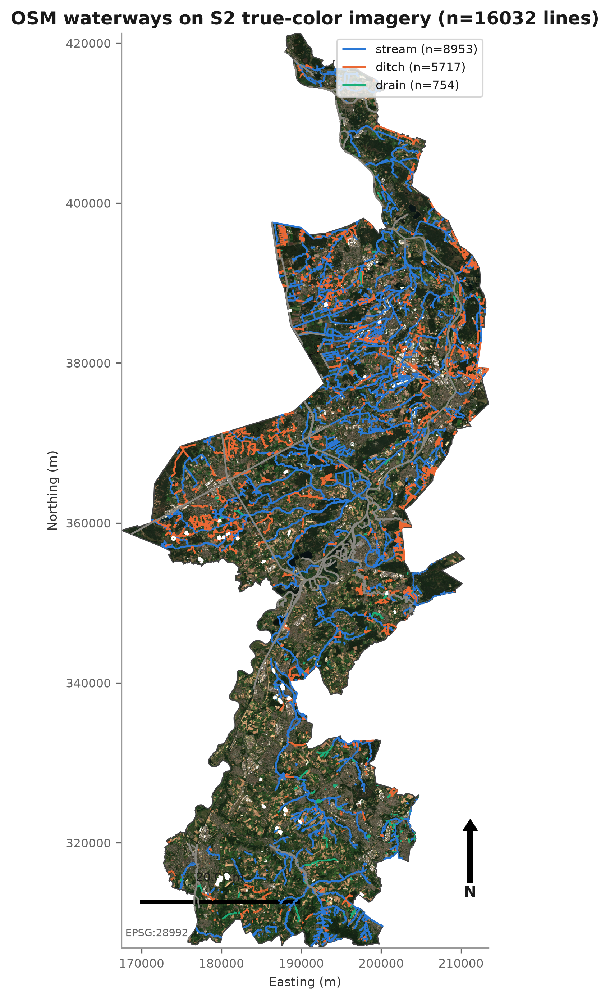
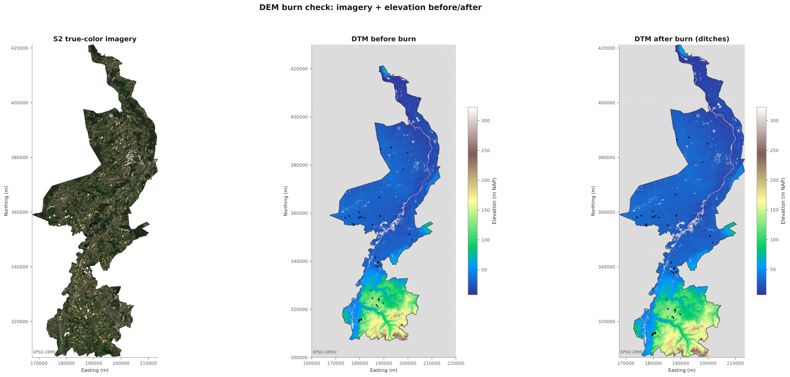
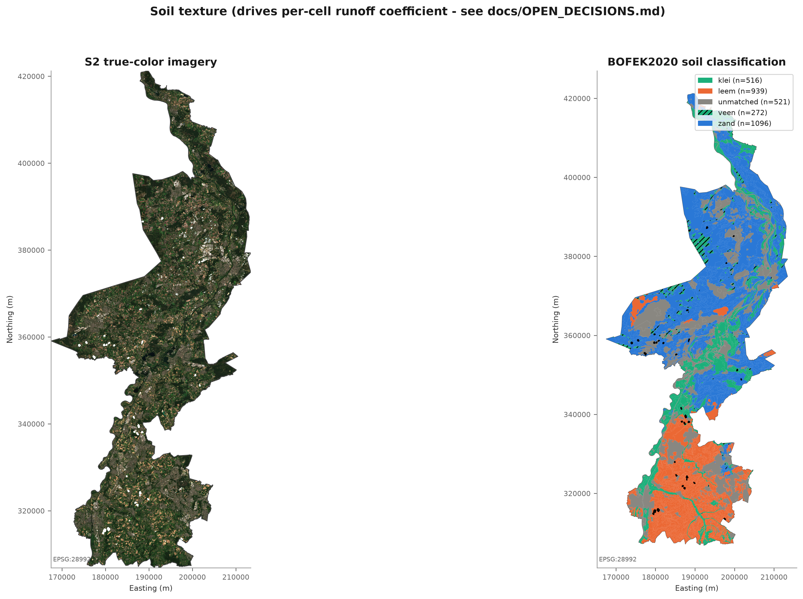
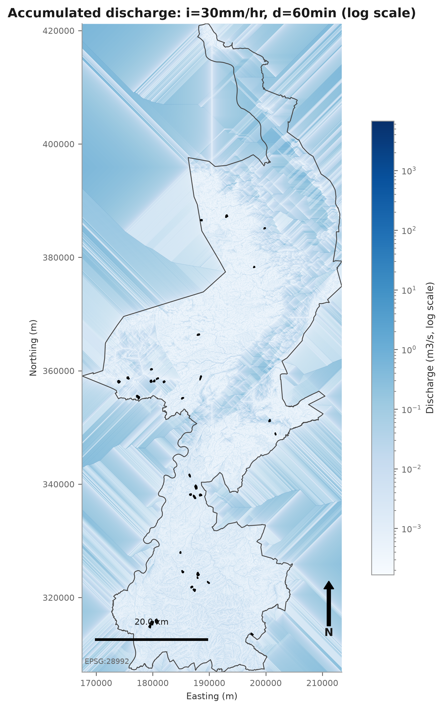
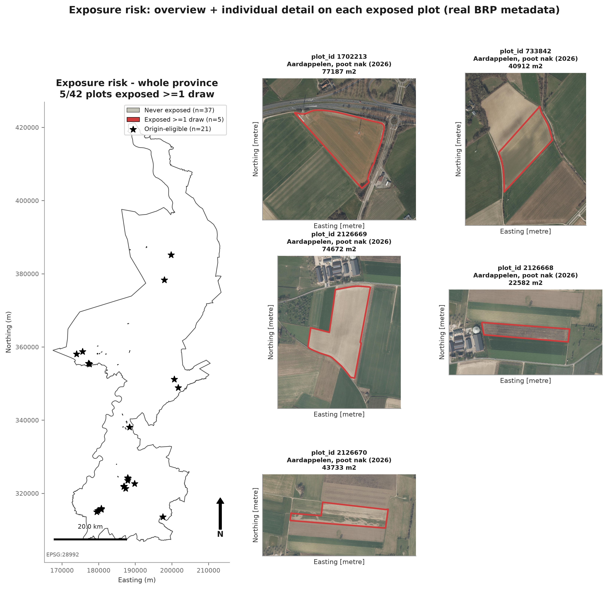
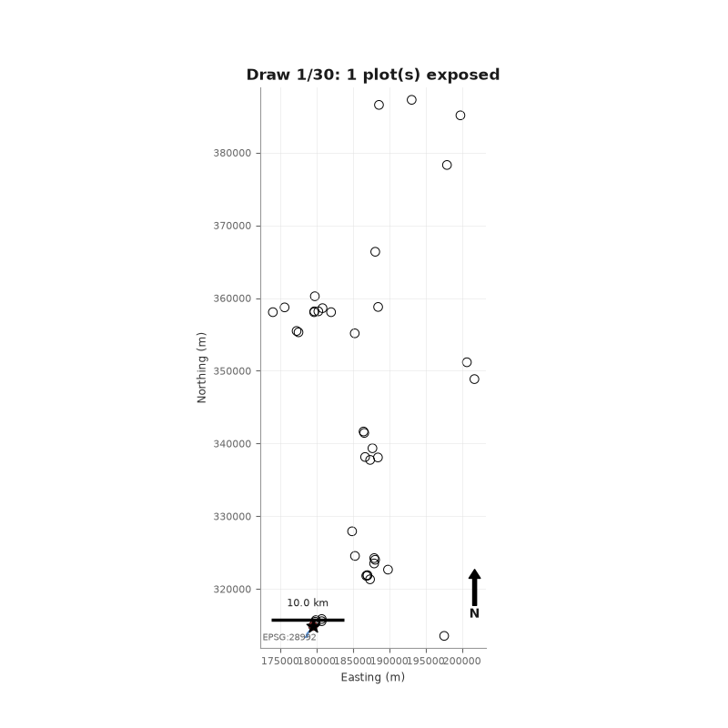
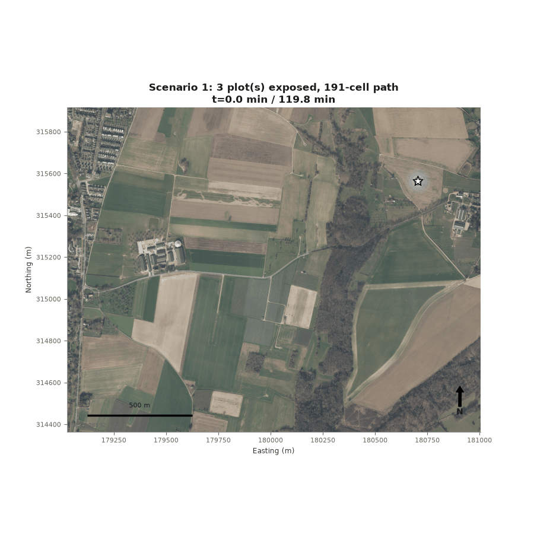
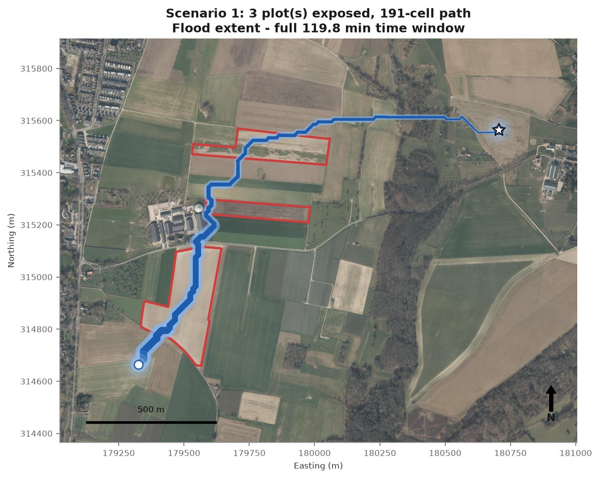

# limburg — brown rot flood-exposure simulation

Simulates how brown rot (*Ralstonia solanacearum*) could spread between seed
potato plots in Limburg province via surface-water flooding, and outputs a
per-plot exposure risk.

## The idea

Brown rot survives in surface water. A plot that already overlaps
SAR-detected standing water is treated as an infection **origin**. Given a
rainfall event (intensity + duration), water runs off the land, follows the
real terrain and ditch network downhill from that origin, and any plot the
flood reaches downstream is flagged as **newly exposed**. Soil type controls
how much of the rain actually runs off versus soaks in.

This is origin-dependent contamination transport, not a generic flood map —
every simulation starts from one specific already-contaminated plot, because
that is the actual disease mechanism being modeled.

## Methodology

1. **Terrain network.** The AHN4 DTM is "burned" with OSM waterway ditches
   (lowered along real channels so water is forced to follow them, not raw
   terrain noise), then depression-filled. Every cell gets a single
   downhill neighbor (D8), giving a strict drainage network with no cycles.
2. **Rainfall → runoff.** For a chosen rainfall intensity and duration, each
   cell generates runoff via the Rational Method (`Q = C·i·A`), where `C`
   comes from BOFEK2020 soil texture (clay/loam/sand/peat run off at
   different rates).
3. **Routing.** Runoff is accumulated downstream, cell by cell, in strict
   topological order from the Layer 0 network — so a confluence always sums
   correctly before passing its discharge further down.
4. **Origin sampling.** One already-contaminated plot (SAR water overlap) is
   drawn at random as the event's source.
5. **Exposure.** Any plot the accumulated discharge reaches, above a minimum
   capacity threshold, is marked exposed. Repeating this many times (Monte
   Carlo) over random origins gives a per-plot exposure *probability*, not
   one arbitrary flood map.

## Pipeline walkthrough

Each step below is a real run on Limburg's actual seed potato plots, terrain,
and soil data — no synthetic placeholders.

| Step | Output |
| --- | --- |
| 00 — Seed potato plots (BRP, real bounds) |  |
| 01 — Baseline contamination (SAR water ∩ plots) |  |
| 02 — OSM waterway network |  |
| 03 — DTM before/after ditch-burning |  |
| 04 — BOFEK2020 soil, clipped to province |  |
| 05 — Discharge accumulation for the default scenario |  |
| 06 — Exposure risk map, zoomed into the most-exposed plots |  |
| 07 — Monte Carlo simulation (animated) |  |

## Scenario 1: worst-case spread

`08_scenario_1.gif` is one of several dedicated simulations searched out of
500 random origins for being the most illustrative (here: the draw with the
longest flow path and the most plots exposed). It replays the flood
front — real PDOK aerial imagery underneath, actual plot boundaries — from
the origin plot outward over time:



Final flood extent from that same run:



Three more scenarios (`08_scenario_2.gif` … `08_scenario_4.gif`) live in
`outputs/figures/` for comparison — same search, different illustrative
draws.

## Running it

Everything is a proper package (`limburg.*`), run with `-m` from the repo
root (one level up, `br_simulation/`):

```bash
cd /Users/neerajkaroshi/Desktop/Projects/br_simulation

# 1. Raw data acquisition (plots, DTM, Sentinel-1/2, waterways)
python -m limburg.run_limburg

# 2. Full Layer 0-3 risk pipeline: network -> scenario grid -> Monte Carlo
#    exposure -> risk map + scenario GIFs
python -m limburg.run_limburg_risk

# 3. Interactive dashboard (sliders for intensity / duration / time window),
#    reads the caches step 2 already wrote
PYTHONPATH=. streamlit run limburg/dashboard/app.py
```

Every step is skip-if-already-cached — safe to re-run after an interruption,
and deleting one cached file under `data/` or `outputs/` forces just that
step to recompute.

### Required manual input

`data/BOFEK_2020_Shape.zip` — the BOFEK2020 Dutch soil map, from Wageningen
Environmental Research (WUR). Not fetched automatically; place it at that
path before running step 2.

## Repo layout

```
limburg/
├── common.py                  REPO_ROOT / load_config()
├── run_limburg.py              raw data acquisition entrypoint
├── run_limburg_risk.py         Layer 0-3 risk pipeline entrypoint
├── config/limburg_config.yaml  every data source, path, and tunable constant
├── boundaries/                 province polygon + seed potato plots
├── fetch/                      one module per external data source
│   ├── sentinel1.py, sentinel2.py, ahn4_dtm.py, waterways.py
│   ├── bofek2020.py            BOFEK2020 soil map loader
│   └── pdok_aerial.py          high-res aerial tiles for scenario GIFs
├── process/                    per-scene computation (NDWI, S1 water, DTM burn)
├── mosaic/                     per-source tile merge
├── network/                    D8 flow direction, graph build, plot-label raster
├── scenario_routing/           rainfall scenario grid + discharge accumulation
├── exposure_mc/                origin sampling + Monte Carlo exposure aggregation
├── visualize/                  all pipeline figures + scenario GIF generation
├── dashboard/                  Streamlit interactive app
├── standalone/                 dependency-free AHN DTM downloader
├── data/                       raw/interim/processed caches (gitignored) + BOFEK zip
└── outputs/                    figures + exposure_risk_limburg.csv
```
